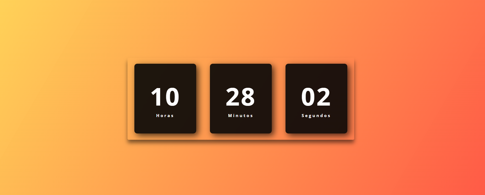

<h1 align="center"> Relógio Digital </h1>

Aplicação front-end desenvolvida com objetivo de praticar e reforçar conceitos de HTML, CSS e JavaScript. 

 

  

- [Acesse o projeto finalizado, online](https://relogio-digital-brs.vercel.app/)
  

  

 

## 🚀 Tecnologias

Esse projeto foi desenvolvido com as seguintes tecnologias:

- HTML
- CSS
- JavaScript

## 💻 Projeto

- 
A aplicação consiste em um relógio digital dinâmico simples, para que o usuário possa acompanhar as horas de forma precisa e em tempo real.    

---

Feito por Bernardo Sá :wave: [Participe da comunidade da Rocketseat!](https://discord.gg/rocketseat)